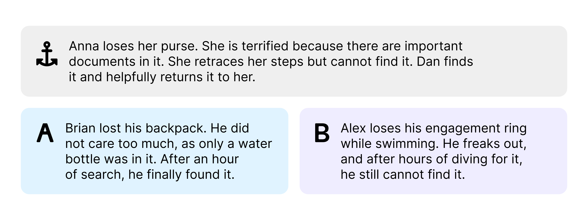

In the shared task **SemEval-2026 Task 4: Narrative Story Similarity and Narrative Representation Learning**, you (or rather your systems) are asked to identify narratively similar stories.
We define Narrative similarity by three core similarity components: the *abstract theme*, the *course of action*, and the *outcomes* of a story.

In simple terms, the aspects can be described as follows:
- Abstract Theme: The ideas and motives of the story.
- Course of Action: The sequence of central events, turning points, etc.
- Outcomes: The results of a story.

For a detailed definition, check out our [annotation guidelines](static/narrative-similarity_annotation-guidelines.pdf)! For details on the exact task setup, check out the [task details](/task-details).

## Example
This sample illustrates the similarity judgments required for our task. The actual tasks contain story summaries from Wikipedia.
Which option, **A** or **B**, is more narratively similar to the anchor story?

**Click below** to reveal the answer:

  
Reveal Answer

  In the above example, story A is considered more similar.
  A, B, and the anchor all tell the story of a lost item that is retrieved. In the case of A, it is found by a third party (as it is in the anchor), while in B it is not found at all.

## All Submissions Are Welcome!
While we appreciate all submissions, we want to encourage the submission of **symbolic representation**-based systems.
Can any story grammar, narrative graph, or schema be used to represent a story for similarity judgements? We would like to know!
As we expect symbolic systems to have a harder time exploiting biases in our data, we will maintain separate rankings for symbolic submissions.

## Contact
Please stay up to date by following us on [Bluesky](https://bsky.app/profile/narrativesimtask.bsky.social) and joining our [mailing list](https://groups.google.com/g/narrative-similarity-task).
If you have any questions directed at the organizers, you can reach us [here](mailto:narrative-similarity-task-organizers@googlegroups.com).

## Organizers
- [Hans Ole Hatzel](https://www.inf.uni-hamburg.de/en/inst/ab/lt/people/hans-ole-hatzel.html), University of Hamburg
- [Ekaterina Artemova](https://scholar.google.com/citations?user=G0lCb3wAAAAJ), [Toloka AI](https://toloka.ai/)
- [Haimo Stiemer](https://www.linglit.tu-darmstadt.de/institutlinglit/mitarbeitende/stiemer/stiemer.de.jsp), Technical University of Darmstadt
- [Evelyn Gius](https://www.linglit.tu-darmstadt.de/institutlinglit/mitarbeitende/gius/), Technical University of Darmstadt
- [Chris Biemann](https://www.inf.uni-hamburg.de/en/inst/ab/lt/people/chris-biemann.html), University of Hamburg

## Acknowledgments
Thank you to [Toloka AI](https://www.linkedin.com/company/toloka/) for providing annotation resources.
The work is supported by the German Research Foundation (DFG) under grant BI 1544/11-2 and GI 1105/3-2 as part of the project ''Unitizing Plot to Advance Analysis of Narrative Structure (PLANS)''. 
