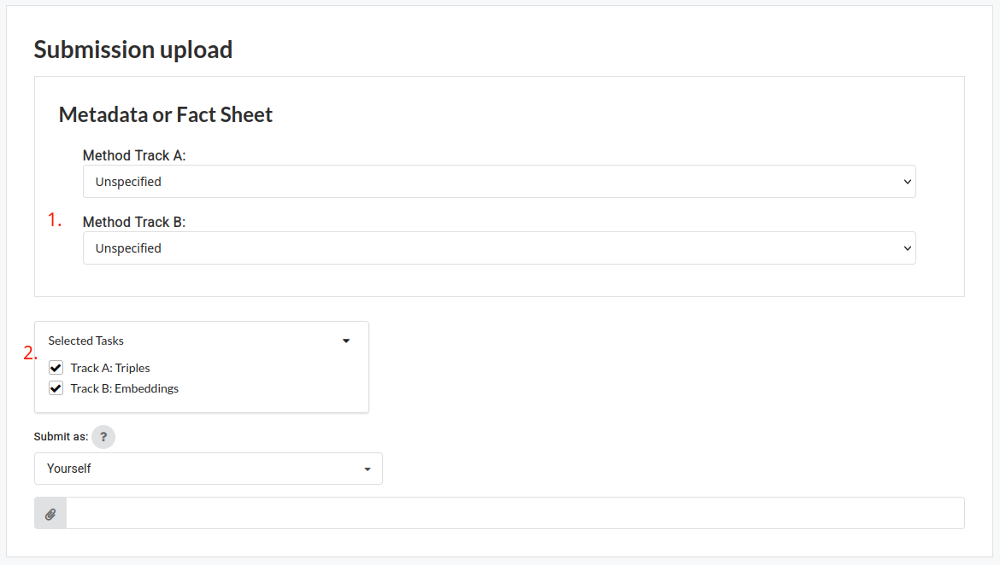

In **Track A**, your system gets a triple consisting of an anchor story and two choices: A and B.
Your system is asked to identify which of the two choices is more similar.

**Track B** instead asks you to produce a vector representation for an individual story.
These representations should have a cosine similarity that aligns with the underlying stories' narrative similarities.
We, the organizers, will validate your submitted representations against triple-wise similarity ratings.

The task will be run on CodaBench. A link will follow soon.

## Baselines
We provide [baseline systems](https://github.com/narrative-similarity-task/semeval-2026-task-4-baselines) for both tracks for you to build upon.

Our output formats for your submission to Codalab are yet to be defined but will be integrated into the baseline systems.

## Rules
In Track B, embeddings are, at inference time, to be created **on individual story instances only**.
You may, for example, not create embeddings such that they align with Track A-style answers for a full cross-product of triples across the provided dataset.
Be kind, have fun!


## How To Submit to CodaBench
You will need to upload a zip file with the following structure:
```
.
├── track_a.jsonl
└── track_b.{npy,jsonl}
```

Make sure to fulfill all these requirements:
- Have a file for each track you are participating in (you can deselect either one on the upload page)
- Both files need to be at the root level of the zip file
- The order in the files must correspond to that in our provided data
- For Track A, your labels need to be in the "text_a_is_closer" property of each line
- For Track B, you may either place your embeddings as a list in the `embeddings` property or provide a numpy serialized file.

The [baseline systems](https://github.com/narrative-similarity-task/semeval-2026-task-4-baselines) document a possible way to create the data.

In the upload form, make sure to specify:
1. the type of method your system is using in each track.
2. which of the tracks (either one or both) you are submitting to.


